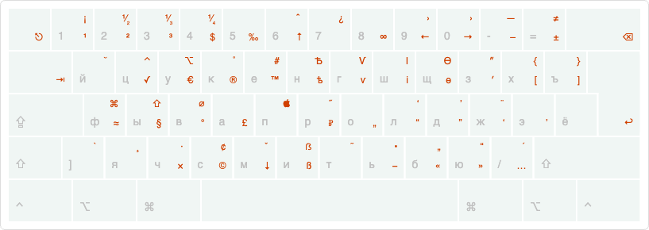

# simple-birman-layout
reduced Birman layout without option modifier for **ONLY** macOS

## Installation
Download [birman_without_option.keylayout](birman_without_option.keylayout) to `~/Library/Keyboard Layouts/` and add it in `System Preferences > Keyboard > Input Sources`.

## Usage
Recomended to use with [Karabiner-Elements](https://pqrs.org/osx/karabiner/).  
An example of use can be found here: [karabiner.json](karabiner.json)